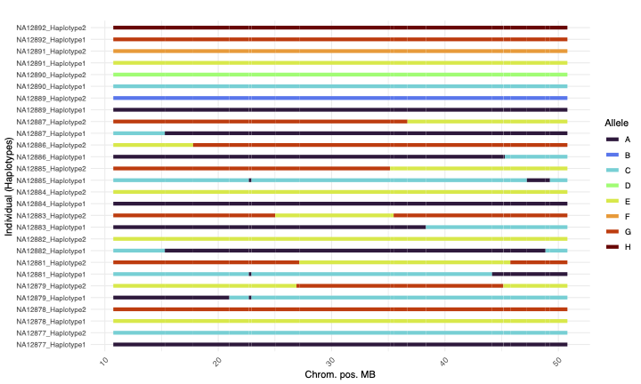

# Haplotype Mapping in Pedigrees

Haplotype mapping is the process of tracking the inheritance of haplotypes from founders to descendants. Given a **pedigree structure** and a **jointly called VCF**, a haplotype map can be constructed by tracing informative haplotype markers across generations. These maps are best built using **HiFi variant calls from DeepVariant** to ensure high accuracy and resolution. This tool makes mapping haplotypes easy by using standard genomic formats and modern tooling.

## Contributors
[zeeev](https://github.com/zeeev), [fakedrtom](https://github.com/fakedrtom), [egor-dolzhenko](https://github.com/egor-dolzhenko), [cilliannolan](https://github.com/cilliannolan), [williamrowell](https://github.com/williamrowell/williamrowell), [holtjma](https://github.com/holtjma)

## Installation

The software is written in **Rust** and can be compiled using **Cargo**. Follow the steps below to build the haplotype mapping tools:

```sh
cd code/rust
cargo build --release
```

After running the build command, two binary tools should be available:

```sh
target/release/gtg-ped-map -h
target/release/gtg-concordance -h
```

---

## Building Haplotype Maps (Step One)

In this step, the **pedigree structure** is read and used to establish relationships between individuals. The **VCF file** is analyzed to identify **informative variant sites** (markers) that distinguish **founders**. These markers are then tracked through the pedigree, assigning haplotypes to each family member.

### Command:
```sh
target/release/gtg-ped-map \
  --ped {ped}.ped          \
  --vcf {vcf}.vcf.gz       \
  --prefix {prefix}
```

### Output Files:

1. `{prefix}.iht.txt` – The haplotype map. A space-delimited file containing:
   - Haplotype block regions (start and end)
   - Unphased founders
   - Phased offspring
   - Number of markers
   - Length of the haplotype block
   - Observed haplotypes across the family.

2. `{prefix}.markers.txt` – The raw SNV markers. A space-delimited file listing:
   - Marker positions
   - Observed markers for founders and offspring.
   - Only valid SNV sites used in the haplotype map. **Short runs of masked markers are excluded.**

3. `{prefix}.recombinants.txt` – Haplotype switch positions for each individual.
   - **Note:** This file **does not represent true recombination events**, as ancestral recombination appears for each child. **Additional filtering is required** to obtain a unique list of recombination events.
   - Breakpoint refinement can be done using `{prefix}.markers.txt`. (**TODO: Further improvements needed.**)

---

## Phasing and Filtering Variants (Step Two)

In this step, variants (**any valid VCF genotype**) are phased according to the **haplotype map** (`{prefix}.iht.txt`). The software determines the **expected genotype patterns** based on the haplotype structure.

### Command:
```sh
target/release/gtg-concordance \
 --ped {ped}.ped               \
 --inheritance {prefix}.iht.txt \
 --vcf {vcf}.vcf.gz            \
 --prefix {prefix}  
```

### Output Files:

1. `{prefix}.pass.vcf` – A **VCF file** containing **phased, haplotype map-concordant variants**.
2. `{prefix}.fail.vcf` – A **VCF file** containing **filtered variants** that did not pass haplotype consistency checks due to:
   - No-calls
   - Low quality
   - Disagreement with the haplotype map.
3. `{prefix}.filtering_stats.txt` – A space-delimited summary of phasing and filtering results per haplotype block:
   - Number of **passing, failing, and no-called** variant sites.
   - A **per-individual failure count** (high counts may indicate **haplotype mapping errors**).

---

## PED File Format
The **PED file** describes the pedigree structure and must contain the following columns:

| Column | Description  |
|--------|-------------|
| **Family ID** | Unique identifier for the family |
| **Sample** | Sample ID |
| **Sex** | 1 = Male, 2 = Female |
| **Father** | Father’s ID (0 if unknown) |
| **Mother** | Mother’s ID (0 if unknown) |
| **Phenotype** | 0 = Unaffected, 1 = Affected |

Note the phenotype field is required, but unused.

### Example PED File:
```
CEPH1463    NA12889    NA    NA    1    0
CEPH1463    NA12890    NA    NA    2    0
CEPH1463    NA12891    NA    NA    1    0
CEPH1463    NA12892    NA    NA    2    0
CEPH1463    NA12877    NA12889    NA12890    1    0
CEPH1463    NA12878    NA12891    NA12892    2    0
CEPH1463    NA12879    NA12877    NA12878    2    0
CEPH1463    NA12881    NA12877    NA12878    2    0
CEPH1463    NA12882    NA12877    NA12878    1    0
CEPH1463    NA12883    NA12877    NA12878    1    0
CEPH1463    NA12884    NA12877    NA12878    1    0
CEPH1463    NA12885    NA12877    NA12878    2    0
CEPH1463    NA12886    NA12877    NA12878    1    0
CEPH1463    NA12887    NA12877    NA12878    2    0
```

---

## Plotting Haplotype Maps


Haplotype maps can be visualized using an **R plotting script**:

### Command:
```sh
Rscript code/plotting/plot_script.R {prefix}.iht.txt plot_output.png
```

This will generate a **haplotype map plot** as `plot_output.png`.



---

## Summary
This pipeline provides a **two-step approach** for **haplotype mapping and variant phasing** using pedigree and VCF data. It consists of:
1. **Haplotype mapping** (`gtg-ped-map`) – Identifies haplotype structure across pedigrees.
2. **Variant phasing and filtering** (`gtg-concordance`) – Uses haplotype maps to phase variants and filter inconsistent sites.

For additional details, please refer to the **literature citations** (*Eberle et al., 2017; Kronenberg et al., 2024*).

---

## Planned Improvements (TODO)
- [ ] **Breakpoint Refinement** – Improve the resolution of recombination breakpoints, buy adding a trimming function
- [ ] **Visualization Enhancements** – Extend plotting scripts for better haplotype visualization.

